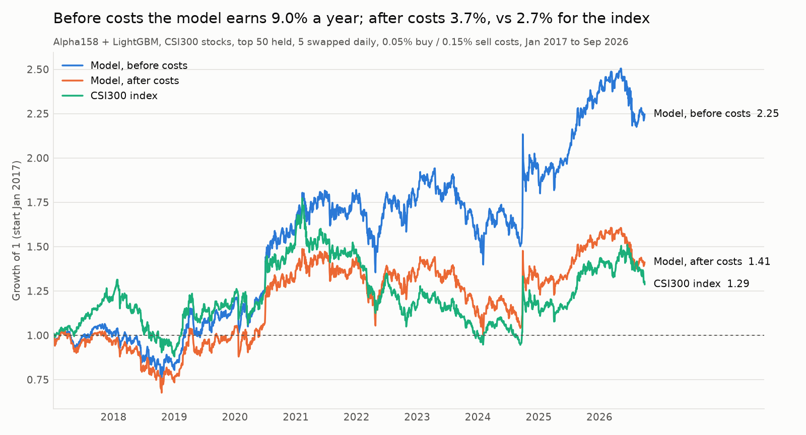
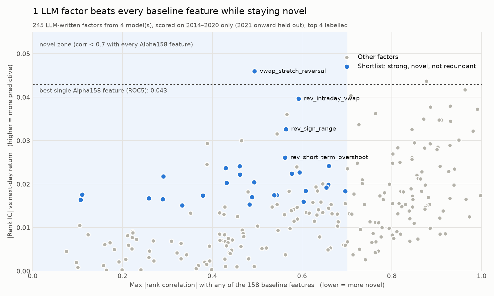
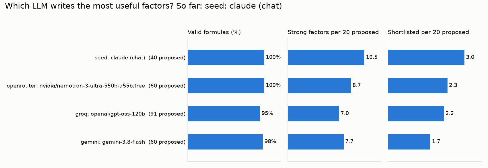

# LLM Alpha Discovery: honest evaluation

[](https://github.com/Chaitya2085/LLM-Alpha-Discovery/actions/workflows/tests.yml)

Large language models invent their own stock-picking signals ("alpha factors"), a
filtering system tests them, and the whole thing is checked rigorously enough to
tell genuine discovery from an LLM simply remembering what happened in the market.

It builds on *Automate Strategy Finding with LLM in Quant Investment* (Kou et al.,
EMNLP 2025, [arXiv:2409.06289](https://arxiv.org/abs/2409.06289)), which reports
+53.17% on China's SSE50 from Jan 2023 to Jan 2024. Our version adds:

- **Several LLMs, mostly free** (Gemini, Groq, Cerebras, OpenRouter, Mistral, local
  Ollama, plus paid Claude/OpenAI), compared side by side
- **A safe factor language**: LLMs write formulas, not code, so nothing they write
  can run anything harmful, and no formula can peek at future prices
- **A held-out test period**: factors are chosen on 2014–2020 only; 2021 onward is
  untouched until the final test
- **Realistic trading**: point-in-time index membership, China's price-limit rules,
  and trading costs
- **A leakage test** (Phase 5): do models that were trained *before* the test years
  do as well as models trained *after*?
- **AI agents and a web app** (Phases 6–7): a team of agents runs the research, and a
  dashboard shows live predictions with confidence scores and plain-English reasons

| Phase | What | Status |
|---|---|---|
| 1 | Data, backtest engine, human-designed baselines | **Done** |
| 2 | LLM factor generation (many providers) and scoring | **Done** |
| 3 | Feedback loop: LLM agents learn from their results | **Next** |
| 4 | Prediction model: combined factors, confidence scores, market regimes | |
| 5 | Honest test on 2021–2026 + leakage experiment | |
| 6 | Multi-agent system that runs the whole pipeline | |
| 7 | High-tech web app: live predictions, explanations, agent console | |
| 8 | Deploy, demo video, final report | |

The full plan, with accuracy targets and what each phase delivers, is in
**[ROADMAP.md](ROADMAP.md)**.

---

## Quick start

Needs Python 3.10+, about 8 GB RAM and 2 GB free disk.

```bash
python -m venv .venv
source .venv/bin/activate              # Windows: .venv\Scripts\activate
pip install -r requirements.txt

python run_phase1.py                   # ~10 min: data, features, baselines, chart, README table
cp .env.example .env                   # then paste at least one free API key into .env
python src/llm.py check                # confirms which keys work
python run_phase2.py --provider gemini groq    # LLMs write factors; scored, charted, README updated
```

Every chart in this README is produced by code into `figures/`, and every results
table is filled in by `src/report.py` from the files in `results/`.

## LLM providers

All free options below need no credit card. Free tiers and model names change, so
`python src/llm.py models --provider <name>` lists what your key can use, and any
model can be chosen with `--model` or `<NAME>_MODEL` in `.env`.

| Provider | Free? | Get a key | `.env` variable | Default model |
|---|---|---|---|---|
| `gemini` (Google AI Studio) | Yes | [aistudio.google.com/apikey](https://aistudio.google.com/apikey) | `GEMINI_API_KEY` | `gemini-3.8-flash` |
| `groq` | Yes | [console.groq.com/keys](https://console.groq.com/keys) | `GROQ_API_KEY` | `openai/gpt-oss-120b` |
| `cerebras` | Yes | [cloud.cerebras.ai](https://cloud.cerebras.ai) | `CEREBRAS_API_KEY` | `qwen-3.8-27b` |
| `openrouter` (`:free` models) | Yes, 50 requests/day | [openrouter.ai/keys](https://openrouter.ai/keys) | `OPENROUTER_API_KEY` | picks a currently free model automatically |
| `mistral` | Yes, low limits | [console.mistral.ai](https://console.mistral.ai/api-keys) | `MISTRAL_API_KEY` | `mistral-small-latest` |
| `ollama` (your computer) | Yes, no key | [ollama.com/download](https://ollama.com/download) | none | `qwen3:8b` |
| `anthropic` (Claude) | Paid | [console.anthropic.com](https://console.anthropic.com) | `ANTHROPIC_API_KEY` | `claude-sonnet-5-5` |
| `openai` | Paid | [platform.openai.com](https://platform.openai.com/api-keys) | `OPENAI_API_KEY` | set with `--model` |

Notes: thinking models on free tiers are slow (a batch of 20 factors can take a few
minutes), so the client waits up to 15 minutes per request. On Google's free tier, prompts may be used to improve Google's products
(fine here, since nothing private is sent). Hugging Face no longer includes free
inference credits for free accounts, so it isn't listed; its open models can be run
locally through Ollama instead. Every LLM reply is saved in `llm_runs/`, so any run
can be re-scored later without calling the API again.

---

## Phase 1: data, backtester and baselines



Daily prices for every stock that was in China's CSI300 index since 2014 (700
different stocks, kept even after they left the index), a day-by-day trading
simulator, and the strategies professionals already use.

<!-- AUTO:phase1_table -->
| Strategy | Rank IC | ICIR | Gross / yr | Net / yr | Excess vs index / yr | Info ratio | Max drawdown | Costs / yr | Paper window* |
|---|---|---|---|---|---|---|---|---|---|
| Reversal 5d | 0.021 | 0.10 | 1.1% | −3.3% | −5.5% | −0.41 | −57.4% | 4.4% | −36.2% |
| Momentum 60d | −0.001 | −0.01 | 4.0% | 0.6% | −1.6% | −0.03 | −59.2% | 3.2% | −8.7% |
| Low volatility 20d | 0.018 | 0.08 | 4.3% | 0.3% | −3.8% | −0.27 | −32.9% | 3.9% | −1.5% |
| Price-volume corr 20d (neg) | 0.015 | 0.09 | 8.4% | 3.7% | +0.7% | 0.12 | −48.9% | 4.4% | −25.8% |
| **Alpha158 + LightGBM** | 0.045 | 0.29 | 9.0% | 3.7% | +0.7% | 0.13 | −33.9% | 4.9% | −21.1% |
| CSI300 index (buy & hold) |  |  |  | 2.7% | +0.0% |  | −46.7% |  | −17.1% |
| Equal-weight CSI300 (gross) |  |  |  | 2.9% | +0.1% |  | −35.0% |  | −15.6% |

Test period 2 Jan 2017 to 9 Oct 2026 (the last year is year-to-date). \*Paper window = 1 Jan 2023 to 31 Jan 2024, where the paper reports +53.17%.
<!-- /AUTO:phase1_table -->

**What we learned**

1. **The machine-learning baseline genuinely predicts returns.** LightGBM on Qlib's
   158 handcrafted factors reaches a rank IC of about 0.045, in line with Qlib's own
   published numbers, which also confirms the data and pipeline are right.
2. **Trading costs eat that edge.** The signal lasts about a day, so the model has to
   trade constantly. Before costs it earns roughly three times the index; after
   costs it is about level with it. Refreshing all 50 stocks daily would earn about
   21% a year gross but cost about 32% a year. **A useful signal has to survive
   costs, not just predict.**
3. **The paper's test year was a losing year for everyone.** Over Jan 2023 to Jan
   2024 the CSI300 fell about 17% and every baseline lost money, which makes a +53%
   result a red flag worth testing (Phase 5).
4. **Classic single factors don't beat the index** long-only after costs.

**Checks:** index returns match the index's published levels; the backtester
matches an independent vectorised calculation (21.3% vs 21.4% gross); a random
signal shows no edge; the regression features match `numpy.polyfit` exactly.

---

## Phase 2: LLMs write factors



Each LLM gets the same prompt (`src/prompts.py`): the factor language, how factors
are used, and the baseline families to avoid copying. The prompt never names the
market, country, tickers or dates. Replies are parsed, validated, de-duplicated
and scored on **Jul 2014 to Dec 2020 only**.

<!-- AUTO:phase2_summary -->
- Discovery period: **1 Jul 2014 to 28 Dec 2020** (2021 onward is held out)
- Factors proposed: **191** from **4** model(s); valid and scored: **190**
- Strong: **84** · novel: **103** · shortlisted: **22**
- Reference: best single Alpha158 feature is ROC5 (rank IC 0.043, t 8.7); median feature |rank IC| 0.018
<!-- /AUTO:phase2_summary -->

**Which LLM writes the most useful factors?**



<!-- AUTO:phase2_models -->
| Model | Proposed | Valid | Invalid | Duplicate | Strong | Shortlisted | Wrong sign | Best factor |
|---|---|---|---|---|---|---|---|---|
| openrouter: nvidia/nemotron-3-ultra-550b-a55b:free | 60 | 100% | 0% | 0% | 26 | 7 | 78% | `rev_short_term` (+0.042) |
| seed: claude (chat) | 40 | 100% | 0% | 0% | 21 | 6 | 28% | `vwap_stretch_reversal` (+0.046) |
| gemini: gemini-3.8-flash | 60 | 98% | 0% | 2% | 23 | 5 | 46% | `range_expansion_momentum` (−0.040) |
| groq: openai/gpt-oss-120b | 31 | 100% | 0% | 0% | 14 | 4 | 71% | `rev_mean_delta_vs_current` (+0.034) |
<!-- /AUTO:phase2_models -->

**Shortlist** (strong: |t| ≥ 3, |rank IC| ≥ 0.015, same sign in ≥ 70% of years;
novel: correlation < 0.7 with every Alpha158 feature; unique: correlation < 0.7 with
any stronger LLM factor). "Flipped" means the factor works in the opposite
direction to the LLM's hypothesis.

<!-- AUTO:phase2_shortlist -->
| Factor | From | Expression | Rank IC | t | Day-to-day stability | Top-fifth excess / yr | Closest baseline feature |
|---|---|---|---|---|---|---|---|
| `vwap_stretch_reversal` | seed: claude (chat) | `-Decay(close / vwap - 1, 10)` | +0.046 | +10.9 | 0.82 | +19.1% | 0.49 (RSV10) |
| `rev_intraday_vwap` | openrouter: nvidia/nemotron-3-ultra-550b-a55b:free | `-EMA((close - vwap) / (high - low), 5) * CsRank(volume)` | +0.040 | +10.4 | 0.56 | +17.2% | 0.59 (VWAP0) |
| `rev_sign_range` | openrouter: nvidia/nemotron-3-ultra-550b-a55b:free | `-Sign(returns) * (close - TsMin(low, 10)) / (TsMax(high, 10) - TsMin(low, 10))` | +0.033 | +8.6 | −0.05 | +12.0% | 0.56 (RANK5) |
| `volume_return_covariance` (flipped) | gemini: gemini-3.8-flash | `EMA(Cov(returns, volume / Mean(volume, 20), 20), 10)` | −0.024 | −6.3 | 0.99 | +6.6% | 0.66 (CORD30) |
| `volume_stability` | seed: claude (chat) | `-Std(Log(volume), 40)` | +0.024 | +6.2 | 0.99 | +9.9% | 0.46 (WVMA60) |
| `corr_close_vol_sign` (flipped) | groq: openai/gpt-oss-120b | `Corr(close, volume, 20) * Sign(returns)` | −0.024 | −6.9 | −0.05 | +0.7% | 0.43 (RANK5) |
| `low_idiosyncratic_vol` | seed: claude (chat) | `-Std(CsDemean(returns), 40)` | +0.023 | +4.8 | 0.99 | +3.4% | 0.59 (STD30) |
| `intraday_close_position` (flipped) | openrouter: nvidia/nemotron-3-ultra-550b-a55b:free | `(close - low) / (high - low) * CsRank(volume)` | −0.022 | −6.0 | 0.52 | −4.8% | 0.58 (KSFT2) |
| `volume_spike_fade` | seed: claude (chat) | `-TsMax(volume, 20) / Mean(volume, 60)` | +0.022 | +6.1 | 0.95 | +5.7% | 0.46 (WVMA20) |
| `vol_cv` (flipped) | openrouter: nvidia/nemotron-3-ultra-550b-a55b:free | `Std(volume, 20) / Mean(volume, 20) * CsRank(volume)` | −0.022 | −5.9 | 0.95 | +2.9% | 0.29 (CORR20) |
| `vol_persistence` (flipped) | openrouter: nvidia/nemotron-3-ultra-550b-a55b:free | `Corr(volume, Ref(volume, 1), 60)` | −0.020 | −5.1 | 0.98 | +14.4% | 0.49 (CORR60) |
| `rev_delta_volume_cross` (flipped) | groq: openai/gpt-oss-120b | `Delta(close, 1) * (1 - CsRank(volume))` | −0.020 | −5.7 | −0.04 | −3.7% | 0.66 (KMID) |
| `volume_weighted_volatility_ratio` | gemini: gemini-3.8-flash | `-Std(returns * volume / Mean(volume, 20), 30)` | +0.018 | +3.8 | 0.97 | −0.0% | 0.61 (STD30) |
| `mom_price_vs_high` (flipped) | openrouter: nvidia/nemotron-3-ultra-550b-a55b:free | `close / TsMax(high, 60) * EMA(volume / Mean(volume, 20), 10)` | −0.018 | −3.9 | 0.94 | +0.6% | 0.70 (VMA60) |
| `pv_accum_dist` (flipped) | openrouter: nvidia/nemotron-3-ultra-550b-a55b:free | `Sum((2 * close - high - low) / (high - low) * volume, 20) / Sum(volume, 20)` | −0.017 | −4.4 | 0.93 | +2.6% | 0.54 (SUMD20) |
<!-- /AUTO:phase2_shortlist -->

**What we learned from the first batch.** The first 40 factors (`llm_runs/seed/`)
were written by Claude in the chat session where this project was designed,
answering the exact prompt above before any factor was scored. They are kept as a
labelled baseline; `--no-seed` leaves them out.

1. **One genuinely new, strong signal:** `vwap_stretch_reversal` (stocks that keep
   closing above the day's average traded price tend to fall back) beat every
   baseline feature, held in all 7 discovery years, and overlaps at most 0.49 with
   the 158 baseline features. Its t-stat of about 11 is far beyond what 40 tries
   could produce by luck.
2. **The LLM's market intuition was often wrong-signed:** 7 of 8 momentum ideas
   worked backwards, because China large caps tend to reverse rather than trend.
3. **Most strong ideas were restatements** of existing reversal features
   (correlation 0.87–0.99); without the novelty check they would look like
   discoveries.
4. **Predictive is not the same as useful long-only:** some factors only spot
   losers, which a fund that only buys can't use. Phase 3 filters on top-fifth
   performance after costs.

**Checks:** 19 automated tests (unsafe code rejected; operators match pandas; changing
future prices never changes past factor values; the LLM client handles every
provider format, rate limits, bad keys and messy replies); the top factor's IC was
recomputed independently with scipy (identical); a time-shuffled placebo gives
an IC of about zero.

---

## Design choices that keep results honest

- **Point-in-time universe:** a stock is eligible only on days it was actually in the
  CSI300, so there's no survivorship bias.
- **No peeking:** signal at the close of day *t*, trade at the open of *t+1*, earn
  open *t+1* → open *t+2*. The factor language only looks backwards (tested).
- **China market rules:** no buying a stock that opens limit-up, no selling one that
  opens limit-down, no trading suspended stocks.
- **Costs:** 0.05% on buys, 0.15% on sells (Qlib's China defaults).
- **Walk-forward training** for the LightGBM baseline, retrained every January.
- **Held-out period:** factor selection uses 2014–2020 only.
- **Market-blind prompts:** no market, dates or tickers, so the Phase 5 leakage test
  compares like with like.

## Data

Daily China A-share data in Qlib format from the community-maintained
[chenditc/investment_data](https://github.com/chenditc/investment_data).
`run_phase1.py` downloads it (about 570 MB) and it is not committed to git. It's a free
community dataset, not a vendor feed: suspension days show as missing prices, ST
stocks' 5% limit isn't modelled, and new trading days are added daily, so results
from a later download differ slightly in the latest year.

## Project layout

```
ROADMAP.md               the plan for Phases 3-8
run_phase1.py            data -> features -> baselines -> chart -> README table
run_phase2.py            tests -> LLM factors -> scoring -> charts -> README tables
src/
  qlib_reader.py         read Qlib .bin files without installing Qlib
  build_dataset.py       CSI300 point-in-time panel, tradability flags, quality checks
  data.py                wide (date x stock) matrices and next-day returns
  features.py            Alpha158 baseline factor set
  build_features.py      compute and save the Alpha158 matrix
  backtest.py            Top-K/Dropout backtester with limits, suspensions, costs
  metrics.py             IC, ICIR, returns, Sharpe, drawdown, information ratio
  run_baselines.py       Phase 1 experiments
  dsl.py                 the factor language: safe parser, operators, evaluator
  prompts.py             LLM prompts (market-blind)
  llm.py                 client for all providers; `check` and `models` commands
  generate_factors.py    ask an LLM, validate, de-duplicate, save to the library
  score_factors.py       score on 2014-2020: IC, stability, novelty, per-model summary
  style.py               shared chart style
  plot_phase1.py         figures/phase1_growth.png
  plot_phase2.py         figures/phase2_strength_vs_novelty.png, figures/phase2_models.png
  report.py              fills the README tables from results/
tests/                   test_dsl.py (factor language), test_llm.py (LLM client)
factors/library.jsonl    every proposed factor: valid, invalid (with reason), duplicate
llm_runs/                every raw LLM reply (prompt, reply, model, tokens)
results/                 CSV/JSON/parquet outputs
figures/                 all charts
```

## Tests

```bash
python tests/test_dsl.py
python tests/test_llm.py
```

They need no data and no API keys, and run automatically on GitHub for every push
(`.github/workflows/tests.yml`).

## Authors

Chaitya Nanavati, with Claude (Anthropic) as AI collaborator.

## License

MIT, see [LICENSE](LICENSE).
